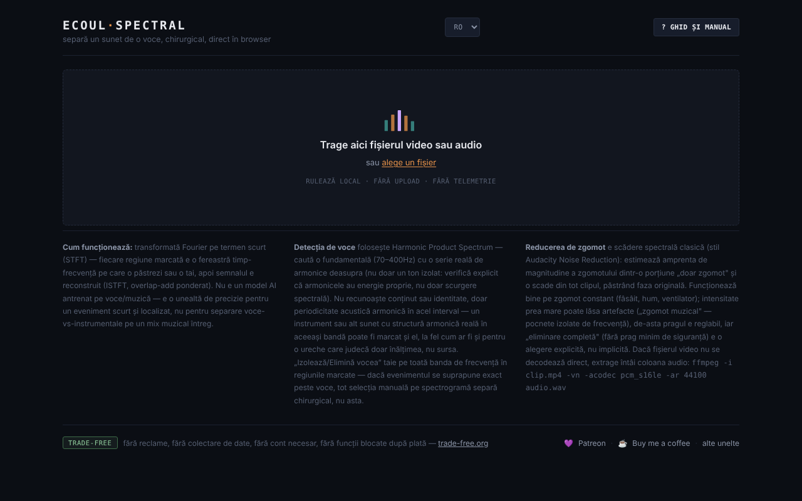

# Ecoul Spectral

Separă un sunet de o voce, chirurgical, direct în browser — editor spectral pe un singur fișier HTML.

**Live:** https://chiuta.github.io/EcoulSpectral/

## Ce este

Ecoul Spectral este un editor de spectrogramă care rulează local în browser. Încarci un fișier audio sau video, marchezi pe spectrogramă o regiune timp–frecvență, apoi o izolezi sau o elimini. Include detecție automată de voce, reducere de zgomot și export WAV. Conform manualului din aplicație, nu este un model AI antrenat: folosește transformata Fourier pe termen scurt (STFT), detecție de periodicitate (Harmonic Product Spectrum) și scădere spectrală clasică; nu înlocuiește separarea voce/instrumental pe un mix muzical complex.

## Funcții

- Încărcare prin drag-and-drop sau „alege un fișier” (audio sau video; dacă video-ul nu se decodează, aplicația afișează o comandă ffmpeg pentru extragerea audio).
- Spectrogramă și formă de undă, minimap pentru tot fișierul, zoom cu rotița, selecție prin tragere, margini ajustabile, câmpuri precise `t0`, `t1`, `f0`, `f1`.
- „Izolează selecția” / „Elimină selecția”, „Decupează la selecție”, „Fondu intrare/ieșire”, „Normalizează”, „Inversează”.
- Anulare/refacere (↩ / ↪), loop pe selecție, viteză de redare (0.5× – 2×), marcaje („+ marcaj la poziția curentă”).
- „Evenimente automate”, cu componente Mid (centru) / Side (lateral) și „exportă toate evenimentele”.
- „Voce automată”: „Izolează vocea” / „Elimină vocea” pe tot clipul, cu prag reglabil.
- „Zgomot de fond”: profil din selecție, automat (fără voce) sau din cea mai liniștită porțiune; „Reduce zgomotul (tot clipul)” cu intensitate reglabilă.
- Comparare A/B, „▶ rezultat”, „↻ folosește ca sursă nouă”, descărcare WAV.
- Ghid integrat: „Tur ghidat”, „Manual”, „Scurtături”.
- Interfață în 7 limbi: RO, EN, FR, IT, ES, PT, DE.

## Manual de utilizare

1. Alege limba (RO / EN / FR / IT / ES / PT / DE).
2. Trage fișierul audio/video pe pagină sau apasă „alege un fișier”.
3. Trage cu mouse-ul pe spectrogramă pentru a marca o regiune; ajustează-i marginile sau scrie valorile în t0/t1/f0/f1 și apasă „Setează selecția”.
4. Apasă „Izolează selecția” (păstrezi doar regiunea) sau „Elimină selecția” (o ștergi). Ascultă cu „▶ rezultat” și compară cu „⇄ A/B”.
5. Pentru voce sau zgomot, deschide secțiunile „Voce automată” / „Zgomot de fond” și alege profilul de zgomot înainte de „Reduce zgomotul”.
6. Dacă vrei să continui editarea pe rezultat, apasă „↻ folosește ca sursă nouă”.
7. Descarcă rezultatul cu „⤓ descarcă WAV”.
8. Scurtături (când nu e focalizat un slider sau o casetă): **Spațiu** redă/oprește, **L** buclă pe selecție, **B** marcaj, **U** anulează, **R** refă, **← →** deplasează selecția (spectrograma focalizată), dublu-click sare la moment, **?** deschide ghidul, **Esc** îl închide.

## Confidențialitate și rețea

- Procesarea audio se face local; fișierul nu este încărcat pe niciun server. Nu am găsit în cod apeluri `fetch`/XHR sau resurse externe încărcate automat.
- **Stocare locală:** `localStorage`, cheia `ecoulSpectral.settings.v1` (praguri, intensitate zgomot, limbă, viteză de redare). Fișierele audio nu sunt salvate.
- Linkurile din subsol (Patreon, Buy Me a Coffee, trade-free.org, chiuta.github.io) se deschid doar la click. Etichetele Open Graph din cod indică `chiuta.github.io`, fără efect la rulare.

## Rulare locală / offline

Descarcă `index.html` și deschide-l în browser; nu necesită internet. Decodarea formatelor depinde de codecurile browserului.

## Licență

Licența nu este încă declarată explicit în acest repository; vezi nota din aplicație. Aplicația se descrie ca „trade-free: fără reclame, fără colectare de date, fără cont necesar, fără funcții blocate după plată”.

## Autor

Alexio — Alexandru-Ionuț Chiuță, contact: alexio@trom.tf.

## English summary

Ecoul Spectral is a single-file, in-browser spectrogram editor: select a time-frequency region and isolate or remove it, detect or remove voice (harmonic product spectrum), reduce noise (spectral subtraction), then export WAV. It uses classic DSP, not a trained AI model. Audio never leaves the browser; only settings are kept in localStorage. 7 UI languages. License not yet declared.
